# Conscious Connections Project Context

> [!NOTE]
> This document is the long-term architectural knowledge base for the Conscious Connections platform. It favors stable domain, architecture, module, and workflow knowledge over temporary implementation notes.

## 1. Project Overview

| Item | Description |
| --- | --- |
| Project Name | Conscious Connections |
| Project Type | Laravel-based educational platform and community learning ecosystem |
| Primary Domain | Age-appropriate sexual health, consent, relationships, and community education |
| Core Users | Learners, parents/guardians, instructors, connectors, and administrators |
| Current Architecture | Laravel MVC with Blade views, service-layer business logic, Eloquent models, policies, Spatie RBAC, queues, notifications, payments, livestreams, and realtime chat |

Conscious Connections exists to provide safe, structured, age-aware learning about sexual health, consent, relationships, personal development, and community education. It combines formal learning modules with instructor-led content, parent-child transparency, connector-led community programming, paid subscriptions, paid modules, seminars, livestreams, and centralized moderation.

### Vision

Build a trusted education ecosystem where learners, parents, educators, organizations, and platform administrators can collaborate around sensitive learning topics with safety, transparency, and accountability.

### Mission

- Deliver accurate, age-appropriate, and accessible education.
- Help instructors publish structured learning content responsibly.
- Give parents and guardians visibility into child learning activity.
- Enable organizations to host community education through connectors and seminars.
- Sustain the platform through subscriptions, paid modules, and transparent financial reporting.

### Primary Objectives

- Provide self-paced learning through modules, lessons, lesson topics, quizzes, progress, and certificates.
- Protect learners through age brackets, parent-child workflows, verification, RBAC, moderation, and suspension handling.
- Support instructors with authoring, review, enrollment, assessment, image library, profile, subscription, and earnings tools.
- Support connectors as approved organizations with memberships, dynamic roles, invitations, seminars, livestreams, and future organization-level entitlements.
- Give admins complete operational control over users, roles, plans, payments, content review, moderation, finance, connectors, parent verification, and seminars.

### Target Users

- **Learners:** students and adults consuming modules, lessons, quizzes, certificates, seminars, chat, and subscriptions.
- **Children:** learner accounts linked to a parent/guardian with added verification and monitoring controls.
- **Parents/Guardians:** users who create or link children, review child activity, and approve sensitive child enrollment workflows.
- **Instructors:** educators who create modules, lessons, topics, quizzes, seminars as speakers, and monetized learning content.
- **Connectors:** verified organizations such as schools, NGOs, advocacy groups, health organizations, government groups, and community-based organizations.
- **Admins:** platform operators responsible for safety, subscriptions, moderation, finance, user management, and governance.

### Current Platform Scope

- [x] Authentication and role-aware dashboards
- [x] Learning modules, lessons, topics, quizzes, progress, gamification, certificates
- [x] Instructor applications, instructor profiles, content authoring, content governance
- [x] Learner and instructor subscriptions
- [x] PayMongo payment links, webhooks, invoices, receipts, refunds, payment history
- [x] Paid module purchases, revenue ledgers, commissions, instructor earnings, financial reports
- [x] Parent-child verification, invitations, monitoring, and enrollment approval
- [x] Chat, message requests, attachments, reports, read receipts, realtime events
- [x] Centralized moderation, violations, enforcement, suspensions, appeals, automation rules
- [x] Connector registration, approval, memberships, dynamic roles, invitations, requests
- [x] Connector seminars, speaker workflow, registrants, livestream, attendance, interactions
- [x] Notifications across admin, learner, instructor, connector, parent, moderation, chat, and seminar flows
- [x] PSGC location data endpoints
- [x] Public landing, legal pages, APK download support, certificate verification

### Platform Philosophy

The platform is not only an LMS. It is an education, safety, monetization, and community governance system. Learning content is treated as sensitive and role-aware. The architecture keeps controllers thin, pushes business rules into services, uses RBAC and policies for authorization, and centralizes moderation and financial reporting so future features can reuse established platform contracts.

## 2. Project Summary

Conscious Connections lets learners discover age-appropriate modules, enroll or purchase access, complete lessons and lesson topics, take quizzes, earn progress and certificates, join seminars, interact through chat, and manage subscriptions. Instructors create and submit learning content, manage enrollments and assessments, receive notifications, maintain professional profiles, and view revenue from paid modules. Parents link to children and monitor selected child activity. Connectors represent organizations that can host seminars, manage members, assign custom roles, invite participants, and run livestream events. Admins govern the whole platform.

### Learning Ecosystem

- **Self-paced learning:** modules contain lessons, lessons contain lesson topics, and quizzes assess understanding.
- **Age-aware education:** learner age categories restrict module and seminar discovery.
- **Creator workflow:** instructors and admins can author content; submitted modules pass through review and governance workflows.
- **Community programming:** connectors host seminars and webinars for learners and instructors.
- **Feedback loops:** learners provide module feedback and reports; instructors review assessments; admins review reports and moderation cases.

### Community, Safety, and Sustainability

- **Community goals:** create a trusted space for learners, educators, guardians, and organizations.
- **Safety goals:** enforce verification, role boundaries, age restrictions, content review, message reporting, centralized moderation, suspensions, and appeals.
- **Sustainability model:** learner subscriptions, instructor subscriptions, module purchases, commissions, future connector subscriptions, and premium entitlements.

### How It Differs From A Traditional LMS

Traditional LMS platforms focus on course delivery. Conscious Connections also includes:

- Sensitive-content governance and age-category controls.
- Parent-child transparency and guardian approval.
- Instructor applications and professional profile governance.
- Connector organization workflows with dynamic roles.
- Seminar and livestream programming.
- Built-in payments, subscriptions, revenue sharing, and financial exports.
- Centralized moderation covering content reports, message reports, enforcement, suspensions, and appeals.

## 3. Technology Stack

| Category | Technology | Purpose | Why Selected / Where Used |
| --- | --- | --- | --- |
| Backend | PHP 8.2+ | Runtime language | Required by Laravel 12 and modern PHP ecosystem |
| Framework | Laravel 12 | MVC, routing, queues, notifications, Eloquent, policies, auth | Main application framework |
| Frontend | Blade | Server-rendered UI | Fits Laravel, simple deployment, reusable components |
| Frontend Interactivity | Alpine.js, `@alpinejs/collapse`, `@alpinejs/persist` | Lightweight UI state, dropdowns, collapsible regions, persisted UI preferences | Avoids a full SPA where Blade is sufficient |
| Build Tool | Vite 7 + Laravel Vite Plugin | Asset compilation and dev server | Used for Tailwind, JS, TinyMCE copy, Agora, Echo assets |
| CSS Framework | Tailwind CSS 3, forms, typography | Utility-first styling and responsive layout | Used throughout Blade views and custom UI components |
| UI Components | Blade components under `resources/views/components` | Buttons, cards, badges, alerts, empty states, skeletons, progress bars | Keeps repeated UI consistent |
| Typography | Poppins, Figtree fallback | Platform UI font stack | Configured in `tailwind.config.js` |
| Icons | Inline SVG / existing Blade icons | Navigation, controls, stat cards | Existing app pattern; no dedicated icon package is installed |
| Rich Text Editor | TinyMCE 8 | Lesson topic rich content editing | Used by authoring views and copied through Vite static copy |
| HTTP Client | Laravel HTTP client, Axios | External API calls and browser AJAX | QR generation, payments, chat/API-style UI behavior |
| Realtime | Laravel Reverb, Laravel Echo, Pusher JS | Realtime broadcasting for chat and interactive workflows | First-party Laravel websocket server with Echo-compatible frontend |
| Chat Broadcasting | Laravel events under `App\Events\Chat` | Message sent/updated/request events | Powers chat UI updates and in-app notifications |
| Database | Laravel database layer / Eloquent | Persistent storage | Models and migrations cover users, content, payments, moderation, connectors, seminars, chat |
| Auth | Laravel Breeze-style auth + custom controllers | Login, registration, password reset, verification | Learner, parent, instructor, admin entry points |
| RBAC | `spatie/laravel-permission` | Roles, permissions, middleware, admin RBAC management | Global roles and permission-based route access |
| Policies | Laravel policies | Object-level authorization | Modules, lessons, topics, quizzes, parent-child, profiles |
| Payments | PayMongo | Payment links, checkout, payment methods, webhooks | Philippine payment gateway supporting GCash, PayMaya, GrabPay, cards |
| Billing Models | `Subscription`, `SubscriptionPlan`, `PlanPrice`, `FeatureCatalog`, `PlanFeatureEntitlement`, `Payment`, `Refund`, `Invoice` | Subscription and payment records | Internal monetization layer around PayMongo |
| Queues | Laravel queues/jobs | Invoice generation, email jobs, moderation automation | Configured through Laravel queue system |
| Scheduled Tasks | Laravel Scheduler | Subscription expiration and renewals | `subscriptions:expire` every 15 minutes, `subscriptions:process-renewals` hourly |
| Notifications | Laravel notifications | Role-specific in-app and email-style notifications | Admin, learner, instructor, connector, parent, moderation, seminar, chat |
| Email | Laravel Mail, Mailtrap package, SMTP docs | Transactional mail and testing | Password reset, verification, receipts, subscription notices, analytics reports |
| PDF Generation | `barryvdh/laravel-dompdf` | Certificates, receipts/reports | Server-side PDF generation |
| Browser/PDF Rendering | Spatie Browsershot, Puppeteer | Browser-rendered exports/screenshots where needed | Export and rendering support |
| Export Libraries | `maatwebsite/excel` | CSV/XLSX financial and seminar exports | Financial reports, registrants, attendance, instructor earnings |
| Livestream | Agora RTC SDK NG | Webinars and live seminar rooms | Connector host livestream and learner/instructor join flows |
| Video | Plyr, custom `VideoEmbedHelper` | Video playback and embeds | Lesson topic video content |
| Documents | PDF.js | PDF rendering in browser | Worksheets and PDF previews |
| Translation / TTS | Google Cloud Text-to-Speech, `TopicTranslationService` | Text translation/TTS experience | Learner translation and synthesized audio routes |
| Location Data | `schoolees/laravel-psgc` + local PSGC tables | Philippine regions, provinces, cities, barangays | Registration/profile location data |
| Toasts | Toastify JS | Browser toast feedback | Global `window.toast` helpers |
| Storage | Laravel filesystems | Uploaded images, attachments, documents, APK, certificate PDFs | Public/private storage depending on asset type |
| Caching | Laravel cache | QR cache, app cache, permission cache | Standard Laravel cache layer |
| Testing | PHPUnit 11, Laravel test runner | Feature/unit tests | Existing tests under `tests/` |
| Formatting | Laravel Pint | PHP formatting | Development quality tool |
| Package Managers | Composer, npm | PHP and JS dependency management | `composer.json`, `package.json`, lock files |
| Deployment Surface | Laravel app + Vite build | Server-rendered web app | Deploy as Laravel application with built assets, queue worker, scheduler, Reverb as needed |

## 4. Platform Architecture

### High-Level Architecture

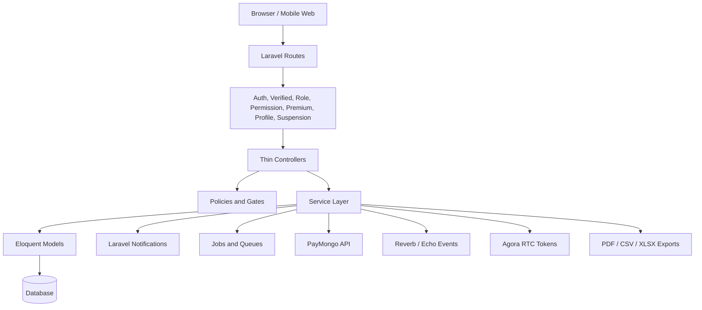

### Layered Architecture

| Layer | Responsibility | Examples |
| --- | --- | --- |
| Routes | URL grouping, middleware, route names | `routes/web.php`, `routes/admin.php`, `routes/instructor.php`, `routes/connector.php`, `routes/api.php`, `routes/channels.php` |
| Middleware | Cross-cutting access checks | `auth`, `verified`, `role`, `permission`, `premium`, `profile.completed`, `suspension.guard`, `paymongo.webhook` |
| Controllers | Request validation, response selection, service orchestration | Admin, Learner, Instructor, Connector, Chat, Moderation controllers |
| Services | Business workflows and transactional logic | `SubscriptionService`, `ModulePurchaseService`, `SeminarLifecycleService`, `ConnectorRoleService`, `SuspensionService` |
| Policies | Object-level authorization | `ModulePolicy`, `LessonPolicy`, `TopicPolicy`, `QuizPolicy`, `ParentChildPolicy` |
| Models | Data relationships, scopes, casts, persistence | `User`, `Module`, `Seminar`, `Connector`, `Payment`, `ModerationCase` |
| Notifications / Events / Jobs | Asynchronous and cross-module effects | payment/subscription lifecycle, chat events, seminar reminders/live alerts, moderation automation |
| Views | Blade UI and reusable components | role-specific layouts and module views |

### Route Shells

```mermaid
flowchart LR
    Public[Public Routes] --> Learner[Learner Shell /learn]
    Public --> Auth[Auth and Registration]
    Public --> Seminars[Seminar Browse]
    Public --> Certificates[Certificate Verification]
    Admin[/admin] --> AdminModules[Admin Operations]
    Instructor[/instructor] --> InstructorModules[Instructor Operations]
    Connector[/connector and /connectors] --> ConnectorModules[Connector Operations]
    Shared[Shared Authenticated Features] --> Chat[Chat]
    Shared --> Parent[Parent Monitoring]
    Shared --> Payments[Payments]
    Shared --> Moderation[Appeals / Suspension Status]
```

### Service Layer

The app consistently uses services for non-trivial workflows:

- **Content:** `ContentAuthoringService`, `ContentAccessService`, `ContentOwnershipGuard`, `ContentGovernanceService`
- **Billing:** `SubscriptionService`, `SubscriptionDunningService`, `PayMongoPaymentLinkService`, `PaymentReceiptService`, `InvoiceService`, `RefundService`
- **Monetization:** `ModulePurchaseService`, `RevenueSplitCalculator`, `ModuleSaleLedgerService`, `CommissionPolicyResolver`
- **Finance:** `FinancialReportService`, filter/export/trend builders
- **Moderation:** `ModerationCaseIntakeService`, `ViolationService`, `EnforcementActionService`, `SuspensionService`, `SuspensionAppealService`, automation services and source adapters
- **Connectors:** access, registration, invitations, membership requests, roles, entitlements
- **Seminars:** access, discovery, registration, lifecycle, speakers, livestream, Agora tokens, attendance, interactions, exports
- **Parent-child:** relationship, invitations, verification
- **Chat:** authorization, context resolving, support admin resolution, message workflows
- **Gamification:** policy resolver, admin service, validator, normalizer, defaults

### Payment Flow

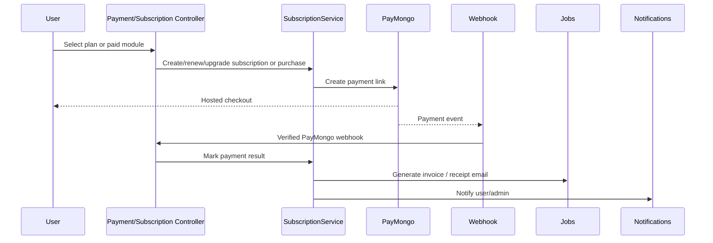

### Livestream Flow

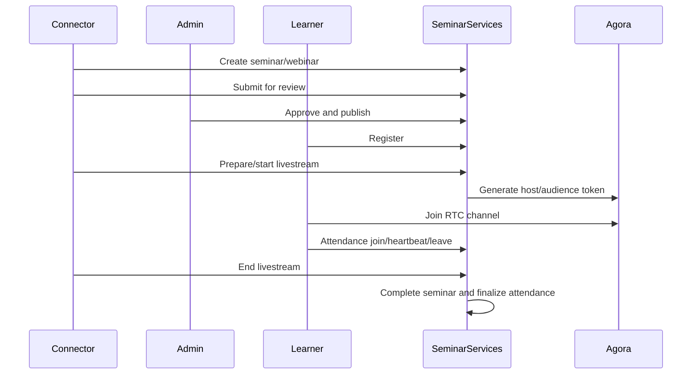

### Moderation Architecture

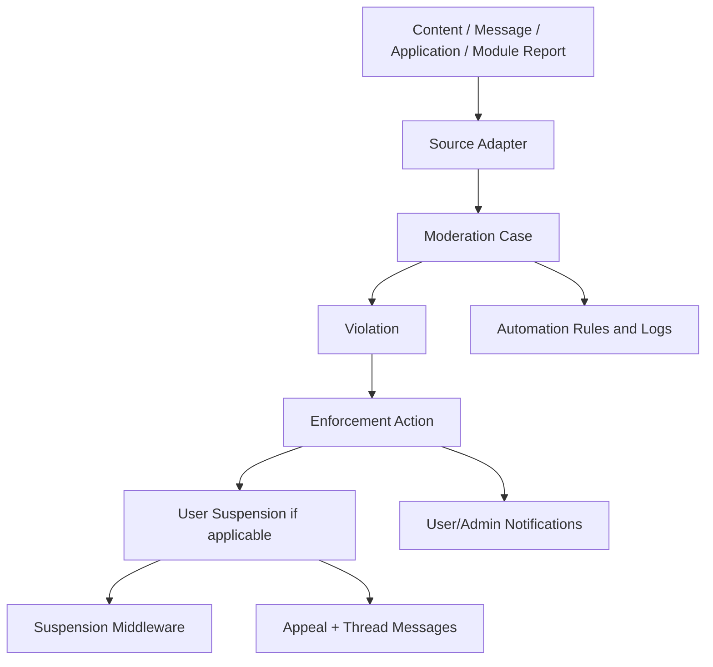

### Connector Architecture

Connectors are organization entities, not global user roles alone. A connector has:

- An approval status controlled by admins.
- Members through `ConnectorMembership`.
- Membership requests and invitations.
- Custom connector-local roles through `ConnectorRole`.
- Connector-local permissions stored through `ConnectorRolePermission`.
- Entitlement concepts for seminars, modules, educators, and future subscriptions.

## 5. Project Module Map

### Admin

- Dashboard and operational metrics
- Admin profile
- Notification center
- User management
- Learner management
- User relationships
- RBAC roles and permissions
- Subscription plan management
- Subscriber management
- Payment management
- Commission settings
- Module revenue
- Financial reports and exports
- Shared module/lesson/topic/quiz authoring
- Content review and module governance
- Instructor application review
- Parent-child verification
- Connector approval, rejection, suspension
- Seminar moderation
- Moderation reports, suspensions, appeals
- Gamification settings
- Calendar placeholder
- Messages entry point
- System settings through config and admin-managed models

### Learner

- Dashboard
- Profile completion and profile management
- Subscription browsing, upgrade, renew, cancel, refund request
- Payment checkout, status, history, receipt
- Module discovery and search
- Module details and reviews
- Enrollment and paid module purchase
- Lesson and lesson-topic viewing
- Topic completion/uncompletion
- Translation and TTS for lesson topics
- Quiz taking, results, history
- Gamification rules, shields, streak savers
- Certificates and certificate downloads
- Instructor profiles and admin creator profiles
- Instructor application workflow
- Parent visibility
- Seminars browse, register, join, comments, questions, attendance
- Chat and message requests
- Content reports
- Notification center
- Suspension status and appeal routes

### Instructor

- Dashboard
- Context switch to learner
- Search
- Notification center
- Speaker invitation inbox
- Connector discovery link
- Seminar browse
- Assessment logs
- Profile and professional background
- Subscription offers
- Payment checkout and history
- Learner management
- Module management
- Module review submit/resubmit/withdraw
- Enrollment management
- Module feedback replies
- Earnings and exports
- Lesson management
- Lesson topic management
- TinyMCE image upload
- Quiz management and CSV import
- Image library

### Connector

- Public connector discovery
- Registration, withdrawal, status
- Dashboard
- Members and removed members
- Membership requests
- Invitations and inbox
- Dynamic connector roles and permissions
- Notifications
- Subscription screen
- Seminars CRUD and lifecycle
- Seminar review submission, publish, archive, cancel, complete
- Speaker search, invitation, approval, rejection
- Registrant approval/rejection/export
- Livestream host room, prepare, start, end, status
- Agora token generation
- Seminar comments/questions moderation and answering
- Attendance tracking and export
- Modules and educators stub/workspace placeholders

### Parent

- Parent registration and verification
- Child account creation
- Child verification and resubmission
- Parent dashboard
- Child profile/activity visibility
- Child quiz attempt review
- Child enrollment review
- Enrollment approval/rejection
- Parent-child invitations
- Learner "My Parent" visibility
- Parent/child notifications

### Cross-Cutting Modules

- Authentication and email verification
- RBAC and permissions
- Policies
- Notifications
- Chat
- Payments
- Subscriptions
- Moderation
- Reports and exports
- PSGC location API
- Public landing, legal pages, APK download, certificate verification

## 6. User Roles

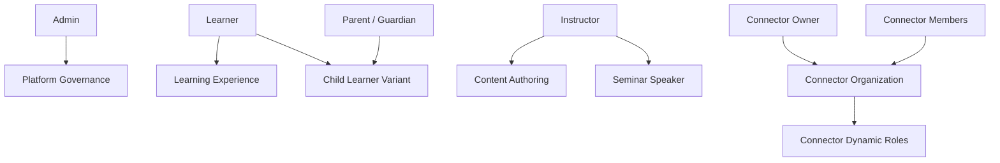

| Role | Purpose | Responsibilities | Primary Permissions / Dashboard |
| --- | --- | --- | --- |
| Admin | Operate and govern the entire platform | Users, RBAC, subscriptions, payments, finance, content review, moderation, connectors, parent verification, seminars | `/admin/dashboard`, `role:admin`, Spatie permissions |
| Learner | Consume learning and community experiences | Complete modules, lessons, quizzes, certificates, seminars, chat, reports, subscriptions | `/learn/dashboard`, learner routes, entitlement checks |
| Child | Age-restricted learner under guardian relationship | Learn with added parent verification, transparency, and enrollment approval where required | Learner dashboard plus parent-child constraints |
| Parent / Guardian | Monitor and protect children | Verify identity, manage child links, approve enrollments, review child progress and quiz activity | `/parent/*` routes |
| Instructor | Create and manage learning content | Author modules, lessons, topics, quizzes, manage enrollments, view assessments, earn revenue | `/instructor/dashboard`, `access instructor panel`, `create modules` |
| Connector | Organization entity that hosts community education | Own seminars, members, roles, invitations, livestreams, future organization features | `/connector/{connector}/dashboard` |
| Connector Owner | Primary member with organization control | Manage profile, members, roles, invitations, seminars, subscription | Connector-local permissions |
| Connector Member | Organization participant | Perform delegated connector tasks | Connector-local role permissions |
| Dynamic Connector Role | Connector-scoped role defined by owner/admin workflow | Encapsulate connector-specific permissions | Permissions in `config/connector_permissions.php` |

### Future Roles

Future roles may include counselor, clinic operator, organization educator, support staff, or moderator-specialist roles. Some schema artifacts already exist for clinics, counselors, consultations, and organizations, but they are not currently complete routed modules.

## 7. RBAC & Permission System

### Authorization Model

The platform combines:

- **Global role string on `users`:** legacy/simple role checks such as `admin`, `learner`, `instructor`, `parent`.
- **Spatie roles and permissions:** route middleware, admin RBAC management, permission syncing, and model role assignment.
- **Laravel policies:** object-level ownership and access decisions for content and relationships.
- **Custom middleware:** premium entitlement, profile completion, suspension status, PayMongo webhook verification.
- **Connector-local roles:** dynamic organization permissions independent of global platform roles.

### Role Hierarchy

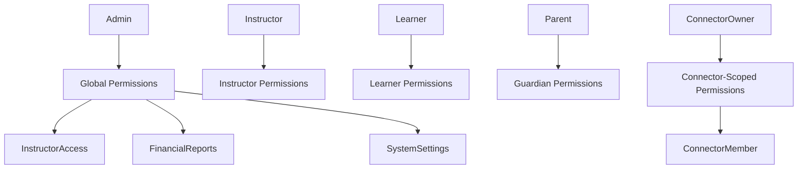

### Permission Evaluation

1. Route middleware blocks unauthenticated, unverified, suspended, or unauthorized users.
2. Global roles and permissions are evaluated by Spatie middleware such as `role` and `permission`.
3. Profile completion middleware ensures learner account setup before learner routes.
4. Premium middleware and `EntitlementService` enforce subscription-backed features.
5. Policies check ownership and object-level access.
6. Connector access services evaluate connector membership, status, local role, and local permissions.
7. Suspension middleware applies centralized enforcement to every web request.

### Connector Dynamic Permissions

Configured connector permission groups:

| Group | Permissions |
| --- | --- |
| Profile | `connector.manage_profile` |
| Members | `connector.manage_members`, `connector.invite_members` |
| Roles | `connector.manage_roles` |
| Seminars | `connector.manage_seminars` |
| Modules | `connector.manage_modules` |
| Educators | `connector.manage_educators` |
| Subscription | `connector.view_subscription` |

Connector entitlements are currently modeled for seminars, modules, and educators. Modules and educators are routed as connector workspace areas but remain placeholders compared with the seminar implementation.

## 8. System Modules

### Authentication

**Purpose:** Provide secure account access for learners, parents, instructors, and admins.

- **Core Features:** registration, login, logout, password reset, password confirmation, email verification, parent approval links, temp upload handling.
- **User Roles:** all users.
- **Connected Modules:** profiles, parent-child, RBAC, verification, notifications.
- **Major Workflows:** register -> verify email -> complete profile -> enter role dashboard.
- **Current Capabilities:** production-level routed auth workflows.
- **Future Expansion:** social auth, MFA, support staff login.

### Profiles

- **Purpose:** Maintain account identity, learner profile details, instructor profile details, admin creator profiles, and profile completion.
- **Core Features:** edit profile, username availability, password update, delete account, learner profile completion, professional instructor profile, admin creator transparency.
- **User Roles:** learner, instructor, admin.
- **Connected Modules:** content attribution, age filtering, instructor applications, certificates.
- **Future Expansion:** richer privacy controls and profile verification badges.

### Messaging / Chat

- **Purpose:** Enable safe user-to-user or support-oriented communication.
- **Core Features:** conversations, discovery, message sending, updates, deletion, attachments, read receipts, message requests, status, reports.
- **User Roles:** permission-controlled authenticated users.
- **Connected Modules:** notifications, moderation, lesson-topic context, admin support.
- **Major Workflows:** discover/start conversation -> request/accept if needed -> exchange messages -> report unsafe message.
- **Current Capabilities:** routed chat UI, realtime events, in-app notifications.
- **Future Expansion:** richer moderation automation, file scanning, message search.

### Notifications

- **Purpose:** Provide role-scoped alerts for platform workflows.
- **Core Features:** notification centers, dropdown read sync, mark-all-read, deep-link resolution, normalized payload display.
- **User Roles:** admin, learner, instructor, connector, parent.
- **Connected Modules:** payments, subscriptions, content review, seminars, moderation, chat, parent-child.
- **Future Expansion:** SMS, push notifications, preference center.

### Learning Modules

- **Purpose:** Organize educational content into learner-facing courses.
- **Core Features:** authoring, age brackets, pricing, enrollment mode, review status, activation, revisions, attachments.
- **User Roles:** learner, instructor, admin.
- **Connected Modules:** lessons, topics, quizzes, enrollments, reviews, purchases, certificates, moderation.
- **Major Workflows:** instructor creates module -> submits for review -> admin approves -> learner enrolls/purchases -> learner completes.
- **Current Capabilities:** mature authoring and learner discovery.
- **Future Expansion:** connector-owned modules, cohort learning, recommendations.

### Lessons

- **Purpose:** Break modules into ordered learning units.
- **Core Features:** create/edit/reorder/move/delete, objectives, content grouping.
- **User Roles:** instructor, admin, learner.
- **Connected Modules:** lesson topics, progress, quizzes.
- **Future Expansion:** lesson prerequisites and adaptive paths.

### Lesson Topics

- **Purpose:** Represent the actual educational content blocks inside lessons.
- **Core Features:** text, video, worksheets, interactive content, ordering, preview, TinyMCE rich text, image upload, captions, translation/TTS routes.
- **User Roles:** instructor/admin authoring, learner consumption.
- **Connected Modules:** image library, translation, progress.
- **Future Expansion:** richer interactive editors, accessibility review, content localization.

### Assessments and Quizzes

- **Purpose:** Assess learner understanding.
- **Core Features:** quizzes, questions, options, multiple question types, attempts, daily shields, limits, import template/preview/confirm, result/history pages.
- **User Roles:** learner, instructor, admin.
- **Connected Modules:** lessons, gamification, certificates, assessment logs.
- **Future Expansion:** question banks, randomized quizzes, adaptive remediation.

### Gamification

- **Purpose:** Increase engagement and reward learning behavior.
- **Core Features:** user gamification, achievements, reward logs, streaks, shields, streak savers, admin policies and policy history.
- **User Roles:** learner, admin.
- **Connected Modules:** quizzes, progress, subscriptions.
- **Future Expansion:** seasonal campaigns, leaderboards, achievement templates.

### Certificates

- **Purpose:** Recognize completed learning.
- **Core Features:** certificate issuance, public verification, learner listing/show/download, PDF generation, certificate snapshots.
- **User Roles:** learner, instructor notification recipients, public verifiers.
- **Connected Modules:** module completion, premium entitlement, PDF generation.
- **Future Expansion:** shareable credential URLs, certificate revocation, verification QR.

### Image Library and Image Upload

- **Purpose:** Support authoring with reusable uploaded media.
- **Core Features:** TinyMCE upload endpoint, image library list/json/upload/delete, topic image embedding.
- **User Roles:** instructor, admin.
- **Connected Modules:** lesson topics, rich text editor.
- **Future Expansion:** image optimization/resizing pipeline, alt-text enforcement, media tagging.

### Subscriptions

- **Purpose:** Control recurring access and premium features.
- **Core Features:** learner subscriptions, instructor subscriptions, plan CRUD, archive/restore/reorder, renewals, cancellation, refund requests, feature catalogs, entitlements.
- **User Roles:** learner, instructor, admin, future connector.
- **Connected Modules:** payments, RBAC, entitlements, certificates, translator/TTS, instructor publishing limits.
- **Future Expansion:** connector subscription enforcement, coupons, trials.

### Payments

- **Purpose:** Process monetary transactions.
- **Core Features:** PayMongo payment links, payment checkout, success/failure callbacks, webhooks, payment history, receipts, admin payment management, refunds, invoices.
- **User Roles:** learner, instructor, admin.
- **Connected Modules:** subscriptions, module purchases, finance, notifications.
- **Future Expansion:** payout automation, reconciliation dashboards, multi-gateway support.

### Revenue Management and Financial Reports

- **Purpose:** Track platform revenue, instructor revenue, commissions, and exports.
- **Core Features:** module sale ledgers, commission policies, commission audits, instructor earnings visibility, admin module revenue, financial trend datasets, PDF/CSV/XLSX exports, report logs.
- **User Roles:** admin, instructor.
- **Connected Modules:** module purchases, payments, subscriptions.
- **Future Expansion:** automated payouts, tax reports, connector revenue sharing.

### Instructor Applications

- **Purpose:** Govern learner transition into instructor role.
- **Core Features:** application form, submit, withdraw, admin review, approve/reject/archive/delete, review records, role transitions, professional profile backfill.
- **User Roles:** learner, admin, instructor.
- **Connected Modules:** RBAC, instructor profile, notifications, moderation.
- **Future Expansion:** interview scheduling, credential verification.

### Parent-Child

- **Purpose:** Add guardian oversight for child learners.
- **Core Features:** parent registration, child account creation, verification, resubmission, parent-child accounts, invitations, child dashboard visibility, quiz and enrollment monitoring, enrollment approval/rejection.
- **User Roles:** parent, child, learner, admin.
- **Connected Modules:** authentication, profiles, enrollment, notifications, moderation, privacy.
- **Future Expansion:** granular guardian controls and consent policies per content category.

### Moderation, Suspension, and Appeals

- **Purpose:** Centralize safety enforcement across reports and user behavior.
- **Core Features:** content reports, message reports, moderation cases, violations, enforcement actions, automation rules/logs, suspensions, appeals, appeal threads, suspension middleware.
- **User Roles:** learner, admin, reported users, moderators via admin role.
- **Connected Modules:** chat, content review, instructor applications, module reports, notifications.
- **Future Expansion:** automated risk scoring, moderator queues, policy versioning in UI.

### Seminars and Livestreams

- **Purpose:** Provide live and scheduled education events.
- **Core Features:** seminar browsing, registration/cancellation, speaker applications/invitations, connector CRUD, admin review, comments, questions, registrant approval, attendance, exports, Agora tokens, host livestream, waiting room/live/completed states.
- **User Roles:** learner, instructor, connector, admin.
- **Connected Modules:** connectors, notifications, moderation, Agora, attendance exports.
- **Future Expansion:** recordings, webinar replay library, calendar integrations.

### Connectors

- **Purpose:** Represent approved organizations that deliver community programming.
- **Core Features:** registration, admin approval/rejection/suspension, dashboard, members, membership requests, invitations, dynamic roles, connector notifications, seminars, subscription screen.
- **User Roles:** connector owners, connector members, admins, learners/instructors discovering organizations.
- **Connected Modules:** seminars, RBAC, subscriptions, notifications.
- **Future Expansion:** connector modules, connector educators, analytics, subscription entitlements.

### Analytics

- **Purpose:** Provide dashboards, trends, and operational reporting.
- **Core Features:** admin dashboard service, analytics service, financial trends, report generation logs, weekly analytics mail class.
- **User Roles:** admin, instructor.
- **Connected Modules:** finance, subscriptions, users, modules.
- **Future Expansion:** cohort analytics, retention reports, connector analytics.

### Admin Dashboard and System Settings

- **Purpose:** Central operating console.
- **Core Features:** dashboard metrics, activity logs, notifications, user operations, settings-like screens for plans and gamification, admin profile.
- **User Roles:** admin.
- **Connected Modules:** all major modules.
- **Future Expansion:** explicit system settings UI for env-independent operational preferences.

### Location / PSGC

- **Purpose:** Provide Philippine location data.
- **Core Features:** regions, provinces, cities, barangays, API endpoints for cities/barangays, PSGC vendor package routes.
- **User Roles:** registration/profile users.
- **Connected Modules:** learner profiles, parent registration.
- **Future Expansion:** map UI and geofenced connector discovery.

### Public Site, Legal, APK, Certificate Verification

- **Purpose:** Provide public entry points outside authenticated dashboards.
- **Core Features:** landing page, privacy, terms, local APK download, APK QR cache/fallback, public certificate verification.
- **User Roles:** guests and public verifiers.
- **Connected Modules:** certificates, mobile distribution, legal compliance.
- **Future Expansion:** public seminar pages, SEO content pages.

## 9. Current Implementation Status

| Module | Status | Notes |
| --- | --- | --- |
| Authentication | Complete | Routed auth, verification, password reset, parent approval links |
| Profiles | Complete | Learner, instructor, admin profile surfaces |
| Admin Dashboard | Complete | Operational shell and notifications |
| Admin User Management / RBAC | Complete | User CRUD, roles, permissions, role transitions |
| Learning Content Authoring | Complete | Modules, lessons, topics, quizzes, image library |
| Module Review / Governance | Complete | Instructor submissions and admin review workspace |
| Learner Learning Flow | Complete | Discovery, enrollment, lessons, topics, progress |
| Enrollment Management | Complete | Instructor/admin queues and parent approval support |
| Quizzes / Assessments | Complete | Learner attempts and instructor assessment logs |
| Gamification | Complete | Learner rewards and admin policies |
| Certificates | Complete | Generation, PDF, verification |
| Subscriptions / Billing | Complete | Learner and instructor subscription flows |
| PayMongo Payments | Complete | Checkout, webhooks, receipts, history |
| Module Purchases / Monetization | Complete | Paid modules, ledgers, commissions |
| Financial Reports | Complete | Admin/instructor exports and report logs |
| Instructor Applications | Complete | Application lifecycle and role transition |
| Parent-Child | Complete | Verification, invitations, monitoring, enrollment approval |
| Chat | Complete | Conversations, requests, attachments, reports, realtime events |
| Centralized Moderation | Complete | Cases, violations, enforcement, suspensions, appeals |
| Connectors | Mostly Complete | Organization registration, approval, members, roles, invitations, seminars; modules/educators are placeholder workspace areas |
| Seminars / Livestream | Functional / Active Refinement | Full seminar lifecycle with Agora livestream and attendance |
| Notifications | Complete | Role-scoped notification centers and many event notifications |
| PSGC Location | Complete | Tables and API endpoints |
| Public Landing / Legal / APK | Complete | Guest entry, legal pages, APK download and QR |
| Clinics / Counselors / Consultations | Schema Only / Future | Models/migrations exist without complete routed UI workflows |

## 10. Subscription & Monetization

### Subscription Audiences

| Audience | Current Purpose | Example Entitlements |
| --- | --- | --- |
| Learner | Unlock learning features and premium experience | username changes, quiz shields, translator, voice/TTS, downloadable certificates, full access |
| Instructor | Unlock publishing and monetization capacity | published module limits, learner caps, paid module publishing, paid enrollment, earnings visibility |
| Connector | Planned / partial | seminar/module/educator entitlements are modeled; subscription UI exists |

### Monetization Model

- Learners can subscribe to plans and purchase paid modules.
- Instructors can subscribe for content publishing and monetization capabilities.
- Admins manage subscription plans, feature catalogs, prices, plan lifecycle, subscribers, and payments.
- Paid modules generate module purchase records and module sale ledgers.
- Commission policies determine platform/instructor revenue split.
- Financial reports provide operational visibility and exports.

### Subscription Access Flow

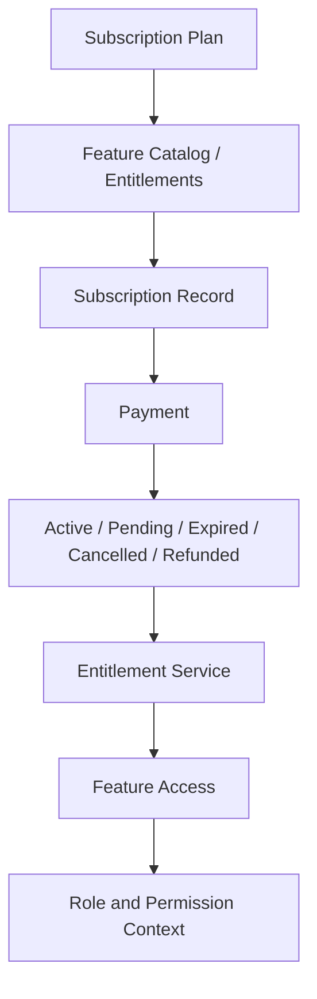

### Dynamic Plan Features

Feature keys are centralized in `config/subscription_features.php`. The admin plan UI reads these definitions so new features can be added in one place and surfaced in plan management, tables, and upgrade pages.

> [!NOTE]
> Subscription entitlements supplement RBAC. RBAC determines who a user is allowed to be; entitlements determine whether a paid capability is available to that user.

## 11. Payment & Financial System

### Payment Gateway

PayMongo is the current gateway. It is configured with:

- Secret/public API keys.
- Test-mode enforcement option.
- API base URL.
- Payment link currency set to PHP.
- Payment methods: GCash, PayMaya, GrabPay, card.
- Webhook secret verified by `paymongo.webhook` middleware.

### Financial Architecture

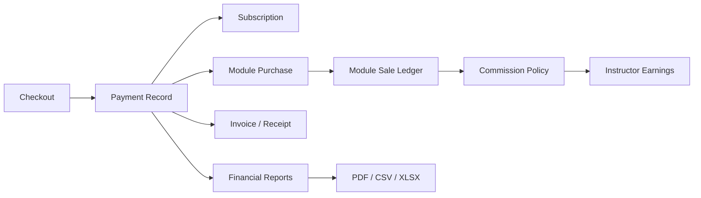

### Core Financial Capabilities

- Subscription payments and renewals.
- Paid module purchases.
- Payment verification through PayMongo callbacks and webhooks.
- Payment history and receipts.
- Refund records and refund request flow.
- Invoice generation jobs.
- Admin payment management.
- Module sale ledgers.
- Commission policy audits.
- Instructor earnings and visibility controls.
- Admin financial reports with PDF, CSV, and XLSX export.
- Report generation logs.

### Future Payout Workflow

Current payout status management exists at the module revenue level. A future payout system should add:

- Payout batches.
- Instructor payout accounts.
- Payout approval and release workflow.
- Gateway or bank disbursement integration.
- Reconciliation and payout receipts.

## 12. Seminar & Livestream System

### Seminar Lifecycle

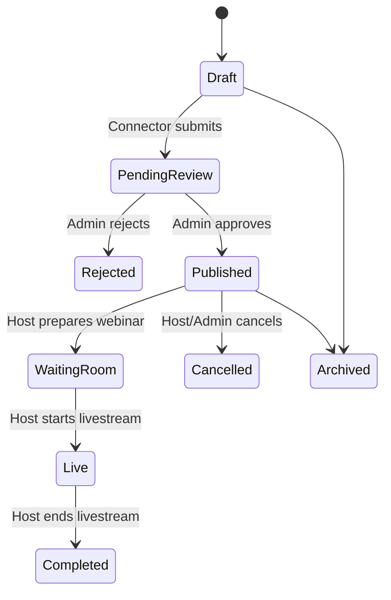

### Core Capabilities

- Connector creates seminars/webinars.
- Connector submits seminar for review.
- Admin approves, rejects, or cancels seminars.
- Learners and instructors browse eligible published seminars.
- Registration can be automatic or manual approval.
- Registrants can cancel before start.
- Speakers can be assigned, invited, approve/rejected, or apply.
- Connector manages registrants and attendance.
- Agora token service issues RTC tokens during join windows.
- Attendance service tracks join, heartbeat, leave, and finalization.
- Comments and questions support interaction and moderation.
- Seminar exports cover registrants and attendance.
- Notifications cover availability, registration decisions, reminders, live status, cancellations, speaker assignment, and invitation responses.

### RTC Flow

1. Seminar must be a published webinar.
2. User must be inside the configured join window.
3. Host prepares the livestream, moving status from scheduled to waiting room.
4. Host starts livestream, moving status to live and notifying eligible participants.
5. Agora token is issued based on role/channel.
6. Audience and speakers join the RTC channel.
7. Attendance records are updated through join/heartbeat/leave endpoints.
8. Host ends livestream, seminar completes, attendance finalizes.

> [!WARNING]
> Livestream access is intentionally time-windowed and status-gated. Do not bypass `SeminarLivestreamService`, `AgoraTokenService`, or seminar access services when adding livestream features.

## 13. Connector System

### Connector Ecosystem

Connectors are organizations that participate in the platform as community education providers. Categories include government, NGO, community-based organization, school/educational institution, health organization, advocacy group, and other.

### Connector Workflow

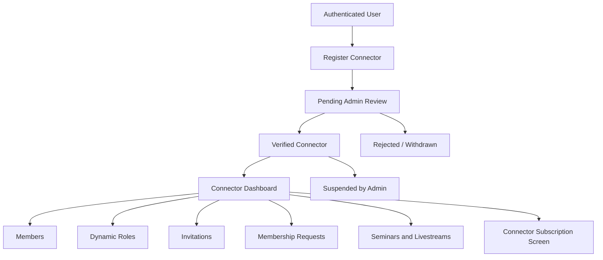

### Current Capabilities

- Public connector directory and connector detail pages.
- Connector registration, status, and withdrawal.
- Admin approval, rejection, and suspension.
- Dashboard and organization navigation.
- Membership requests from users.
- Invitations from connectors.
- Member role updates and removals.
- Removed member list.
- Dynamic connector roles and local permissions.
- Connector notifications.
- Full seminar and livestream management.
- Connector subscription screen.

### Future Expansion

- Connector-owned modules and educator workspaces.
- Organization analytics.
- Connector subscription enforcement.
- Public organization pages.
- Connector revenue sharing.
- Connector-specific certificates or attendance credentials.

## 14. Parent-Child System

### Purpose

The parent-child system protects child learners through verification, transparency, and guardian oversight.

### Core Features

- Parent registration and document upload.
- Child account creation.
- Parent and child verification statuses.
- Admin parent/child verification moderation.
- Parent-child accounts and invitation records.
- Parent dashboard for children.
- Child quiz attempt visibility.
- Child enrollment visibility.
- Parent approval/rejection for enrollment requests.
- Learner "My Parent" visibility.
- Parent/child verification and enrollment notifications.

### Relationship Flow

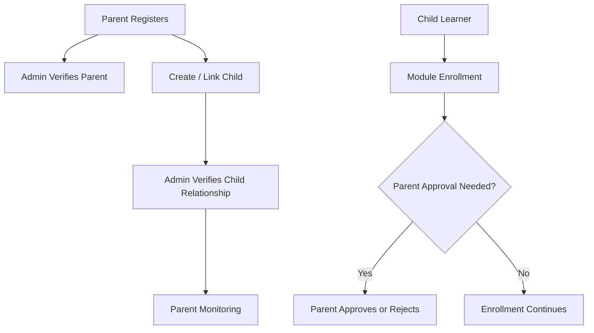

### Privacy Considerations

- Parent visibility should stay scoped to child learning and safety contexts.
- Child accounts remain learner accounts but with extra guardian checks.
- Sensitive data and documents should remain storage-controlled and access-limited.
- Future features should avoid exposing private chat or unrelated learner activity unless explicitly governed.

## 15. Moderation & Safety System

### Centralized Philosophy

Moderation is a platform-wide safety layer, not a per-feature afterthought. Reports from learning content, chat, instructor workflows, and module review can feed centralized moderation cases. Enforcement actions and suspensions are applied consistently and enforced globally through middleware.

### Moderation Components

| Component | Purpose |
| --- | --- |
| Reports | Learner content reports and message reports |
| Source Adapters | Convert source-specific reports into central moderation cases |
| Moderation Cases | Central case record for review and lifecycle |
| Violations | Structured safety findings |
| Enforcement Actions | Warnings, restrictions, suspensions, or related action records |
| User Suspensions | Active/expired/revoked suspension state |
| Appeals | User appeals and admin review with thread messages |
| Automation Rules | Configurable moderation automation with logs and versions |
| Middleware | Blocks suspended users and exposes suspension status |

### Enforcement Flow

1. User submits report or admin identifies issue.
2. Source adapter creates or updates moderation case.
3. Admin reviews case and records violation.
4. Enforcement action is issued.
5. Suspension service creates suspension if action type requires it.
6. User status syncs to suspended when active suspension exists.
7. User can view suspension status and submit appeal.
8. Admin reviews appeal and posts thread messages or decisions.

### Safety Policies

- Centralize enforcement in services.
- Preserve audit trails through activities, logs, versions, and thread records.
- Notify affected users.
- Keep suspension state synchronized with user status.
- Use middleware to enforce active suspensions consistently.

## 16. UI/UX Design System

### Design Language

The platform uses a modern Blade/Tailwind design system with role-specific dashboards, consistent cards, stat surfaces, forms, tables, and notification patterns.

### Color Palette

| Color | Tailwind Tokens | Usage |
| --- | --- | --- |
| Brand Purple / Indigo | `brand.50` through `brand.950`; primary gradient `#A30EB2 -> #730DB1 -> #3B0CB1` | Landing, admin layout, primary actions, premium surfaces |
| Brand Blue | `brand.blue.50` through `brand.blue.900` | Links, secondary highlights, info surfaces |
| Brand Pink | `brand.pink.50` through `brand.pink.900` | Accent states, highlights |
| Semantic Colors | Tailwind green, yellow, red, gray | Success, warning, danger, neutral UI |

### Typography

- Primary stack: Poppins, Figtree, default sans-serif.
- Use readable, role-appropriate headings.
- Dashboard and table UIs should prioritize scanability over decorative layouts.

### Reusable Components

- `x-ui.button`
- `x-ui.card`
- `x-ui.badge`
- `x-ui.alert`
- `x-ui.spinner`
- `x-ui.empty-state`
- `x-ui.skeleton`
- `x-ui.progress-bar`

### UI Patterns

- **Cards:** repeated content blocks, dashboards, module/seminar items.
- **Tables:** admin management, payments, reports, members, registrants.
- **Stat cards:** dashboards, finance, learning progress.
- **Forms:** registration, profile, plans, authoring, moderation decisions.
- **Wizards/steppers:** registration and child account flows.
- **Modals:** confirmations, plan actions, review decisions.
- **Dropdowns:** nav and notification menus.
- **Toasts:** success/error/warning/info feedback through Toastify.
- **Hover effects:** subtle lift/shadow effects.
- **Responsive design:** Tailwind responsive utilities; dashboards should remain usable on mobile.
- **Accessibility:** maintain semantic form labels, button states, contrast, keyboard-compatible controls, and readable status messages.

### Browser Metadata

Public, legal, and dashboard pages should maintain meaningful titles and metadata. Future SEO work should centralize page metadata for public-facing content.

## 17. Architecture & Development Principles

| Principle | Application In This Codebase |
| --- | --- |
| Thin Controllers | Controllers orchestrate requests and delegate workflows to services |
| Service Layer Architecture | Business rules live in dedicated services for subscriptions, payments, seminars, moderation, connectors, content, finance, chat |
| Policy-Based Authorization | Object access is enforced through Laravel policies |
| RBAC-First Design | Routes and admin tools use Spatie roles/permissions |
| Connector-Scoped Authorization | Connector roles and permissions stay local to each organization |
| Reusable Blade Components | Shared UI primitives reduce repeated markup |
| DRY | Feature keys, connector permissions, seminar config, and plan definitions are centralized |
| SOLID / Separation of Concerns | Services focus on specific workflows and controllers remain role-specific |
| Modular Development | Admin, learner, instructor, connector, moderation, chat, and seminar code is foldered by domain |
| Event-Driven Notifications | Payments, subscriptions, chat, seminars, moderation, and parent-child workflows notify users asynchronously or through Laravel notifications |
| Scalable Folder Structure | Models, services, controllers, notifications, events, jobs, exports, enums, and support classes are separated |
| Responsive-First Development | Tailwind and Blade layouts target dashboard usability across screen sizes |
| Performance Considerations | Database indexes for finance, cached QR code, queues/jobs, scheduler, eager loading in services/controllers |
| Maintainability | Prefer durable service contracts and config-driven feature keys over scattered conditional logic |

### Why These Principles Matter

The domain combines education, minors, payments, organizational governance, and moderation. Centralizing business rules reduces duplicated safety checks, makes revenue behavior auditable, and lets future features reuse existing boundaries instead of bypassing them.

## 18. Project Philosophy

Conscious Connections is built around long-term trust.

- **Scalability:** new roles, subscriptions, connector capabilities, and moderation sources should extend existing services and permission systems.
- **Maintainability:** stable module boundaries matter more than clever abstractions.
- **Security:** verification, RBAC, policies, webhook signatures, and suspension middleware protect sensitive workflows.
- **Accessibility:** sensitive education must remain understandable, navigable, and readable.
- **Performance:** dashboards and reports should rely on indexed queries, services, and exports rather than ad hoc view logic.
- **User-centered design:** learners, parents, instructors, connectors, and admins each need focused dashboards instead of one generic LMS screen.
- **Educational impact:** progress, quizzes, certificates, seminars, and parent transparency support measurable learning outcomes.
- **Community building:** connectors and seminars make the platform an ecosystem, not only a course catalog.
- **Sustainability:** subscriptions, module purchases, commissions, and financial reporting support long-term operations.
- **Extensibility:** connector modules, educator workspaces, clinics, counselors, consultations, payout automation, and analytics should build on current models and services.
- **Consistent user experience:** role-specific surfaces should reuse common UI patterns, status language, toasts, cards, tables, and forms.

## 19. Development Timeline

| Milestone | Architectural Significance |
| --- | --- |
| Initial concept | Established an age-aware education platform for sensitive learning topics |
| Core learning system | Added modules, lessons, topics, quizzes, progress, and certificates |
| Instructor system | Added instructor role, applications, profiles, authoring, review, and assessments |
| Subscription system | Added plans, feature catalogs, entitlements, subscribers, renewal/expiration jobs |
| Parent-child implementation | Added guardian verification, child accounts, monitoring, and enrollment approval |
| Payment and monetization | Added PayMongo checkout, invoices, receipts, refunds, module purchases, commissions |
| Chat and notifications | Added conversations, realtime events, message requests, reports, role notification centers |
| Moderation system | Added centralized cases, violations, enforcement, suspensions, appeals, automation |
| Connector ecosystem | Added organization registration, admin approval, members, roles, invitations, requests |
| Seminar platform | Added connector-led seminars, moderation, registrants, speakers, attendance, exports |
| Livestream integration | Added Agora RTC tokens, host livestream controls, join windows, attendance heartbeat |
| Financial management | Added module revenue, instructor earnings, financial report filters, trend datasets, exports |

## Durable Implementation References

| Area | Primary Files / Directories |
| --- | --- |
| Routes | `routes/web.php`, `routes/admin.php`, `routes/instructor.php`, `routes/connector.php`, `routes/api.php`, `routes/channels.php`, `routes/console.php` |
| Middleware | `bootstrap/app.php`, `app/Http/Middleware` |
| Models | `app/Models` |
| Services | `app/Services` |
| Policies | `app/Policies` |
| Notifications | `app/Notifications` |
| Events / Listeners / Jobs | `app/Events`, `app/Listeners`, `app/Jobs` |
| Enums | `app/Enums` |
| Views | `resources/views` |
| UI Components | `resources/views/components` |
| Database Schema | `database/migrations` |
| Config | `config/subscription_features.php`, `config/connector_permissions.php`, `config/paymongo.php`, `config/seminars.php`, `config/billing.php`, `config/chat.php`, `config/reverb.php`, `config/permission.php` |
| Existing Architecture Docs | `docs/system-module-audit.md`, `docs/PLATFORM_FEATURES_OVERVIEW.md`, `docs/UI_COMPONENTS_GUIDE.md`, `docs/CHAT_REALTIME_SETUP_GUIDE.md` |

> [!WARNING]
> Do not treat schema-only models as implemented features. Clinics, counselors, consultations, and legacy organizations exist in the data/model layer but are not complete routed platform modules.

> [!NOTE]
> Future work should extend the existing service layer, policies, RBAC, connector-local permissions, notifications, and moderation pipeline instead of adding isolated one-off flows.
